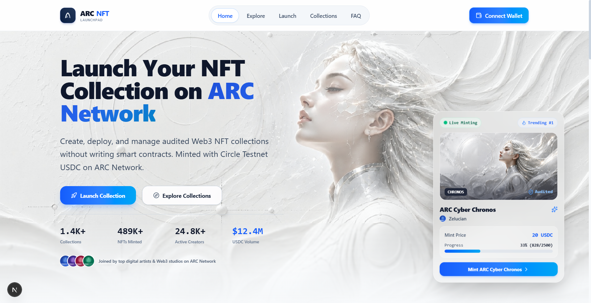
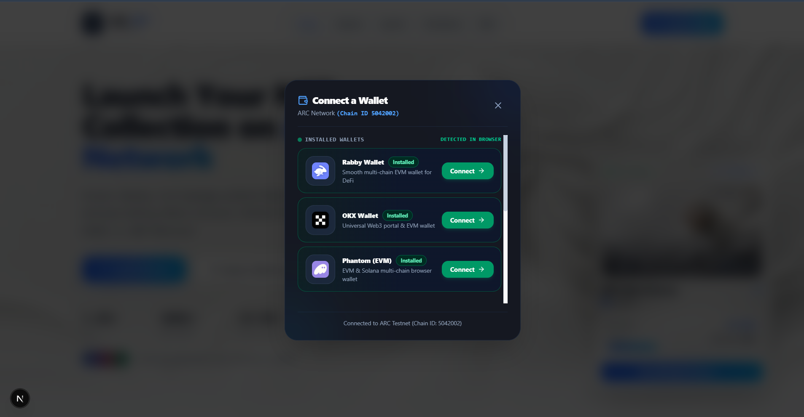
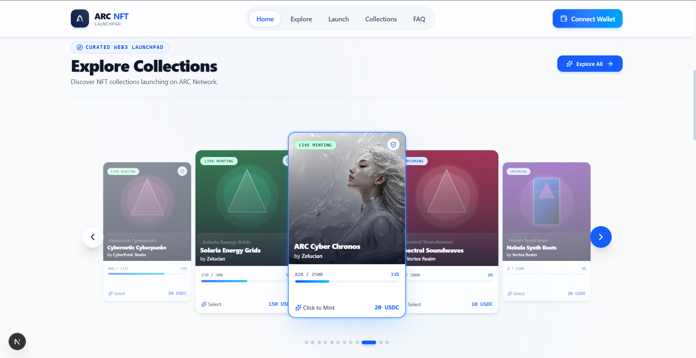
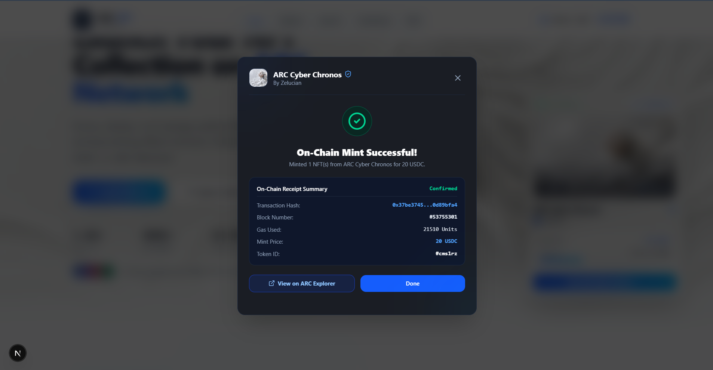

# ARC NFT Launchpad

[](https://nextjs.org/)
[](https://reactjs.org/)
[](https://www.typescriptlang.org/)
[](https://tailwindcss.com/)
[](https://wagmi.sh/)
[](https://viem.sh/)
[](https://www.prisma.io/)
[](LICENSE)

A modern, high-performance, non-custodial Web3 NFT Launchpad built specifically for **ARC Network Testnet** (Chain ID: `5042002`). Create, deploy, explore, and mint audited Web3 NFT collections seamlessly using **Circle Testnet USDC** (`0x3600000000000000000000000000000000000000`) and ERC-721A smart contracts.

---

## 🌟 Project Overview

**ARC NFT Launchpad** provides a unified creator and collector experience for digital assets on the ARC Network. Designed with modern UI/UX principles, seamless Web3 wallet integration, and real-time on-chain token payment transfers, the platform empowers creators to launch verified NFT collections and enables collectors to mint NFTs directly with USDC.

- **Chain**: ARC Network Testnet (Chain ID: `5042002`)
- **Native Currency**: ARC Token (`ARC`, 18 Decimals)
- **Payment Currency**: Circle Testnet USDC (`0x3600000000000000000000000000000000000000`, 6 Decimals)
- **Primary NFT Standard**: ERC-721A High-Gas-Efficiency Contract (`0x7a250d5630B4cF539739dF2C5dAcb4c659F2488D`)

---

## ⚡ Key Features

- **Multi-Wallet Connector Modal**: Automatically detects installed browser extensions (MetaMask, Bitget, Rabby, Coinbase, OKX, Phantom, WalletConnect, Injected) and prioritizes detected wallets with live status badges (`Installed`, `Recommended`).
- **Real On-Chain USDC Payments**: Real-time ERC-20 `transfer` payment execution during minting, deducting exact USDC token amounts on-chain.
- **Strict Network Lock & Auto-Switching**: Automatically prompts users to switch network whenever an unsupported Chain ID (e.g., Chain ID 1 Ethereum, Chain ID 204 opBNB) is connected.
- **Collection Explorer & Filtering**: Filter collections by category (Art, Gaming, PFP, Music, RWA, Utility) and sort by volume, mint price, or creation date.
- **Creator Launchpad Studio**: Non-custodial 3-step creation wizard for launching new NFT collections with custom metadata, mint prices, royalty fees, and supply limits.
- **Real-Time On-Chain Balance Tracking**: Displays real USDC balance and native ARC gas balance directly in the wallet modal and navigation header.
- **Seamless Visual Design**: Ultra-sleek UI featuring glassmorphism, responsive grid layouts, official vector SVG logo containers, and smooth multi-stage gradient transitions.
- **Circle Testnet Faucet Integration**: Direct access link to claim free Circle Testnet USDC for testing mint transactions.

---

## 🖼️ Screenshots

| Home & Hero Section | Connect Wallet Modal |
| :---: | :---: |
|  |  |

| Explore Collections | Mint NFT Modal |
| :---: | :---: |
|  |  |

---

## 🛠️ Tech Stack

### Core Framework & UI
- **Next.js 16.2.11 (App Router & Turbopack)**: Server-side rendering, client components, and API routes.
- **React 19.2.8**: Component-driven user interface.
- **TypeScript 5.7.2**: Strict type safety across Web3 configs, APIs, and components.
- **Tailwind CSS 4.3.3 & PostCSS**: Utility-first responsive styling system.
- **Framer Motion 12.42.2**: Smooth layout transitions and modal animations.
- **Lucide React**: Modern iconography.

### Web3 & Blockchain Integration
- **Wagmi 3.7.4**: React Hooks for Ethereum.
- **Viem 2.55.8**: Lightweight, fast TypeScript interface for EVM blockchains.
- **@coinbase/wallet-sdk 4.3.7**: Coinbase Wallet integration.
- **@walletconnect/ethereum-provider 2.23.10**: WalletConnect v2 QR provider.

### Database & Backend
- **Prisma ORM 5.22.0**: Type-safe database client and schema management.
- **SQLite**: Lightweight relational database storage (`dev.db`).
- **Zod 4.4.3**: Schema validation for API payloads and forms.

---

## 📐 Architecture Overview

```
+-----------------------------------------------------------------------+
|                            User Interface                             |
|    (Next.js App Router, Framer Motion, Tailwind CSS, Lucide Icons)   |
+-----------------------------------+-----------------------------------+
                                    |
                                    v
+-----------------------------------+-----------------------------------+
|                           Web3 Provider                               |
|        (Wagmi Config, Viem Public Client, React Query Provider)       |
+-----------------+-----------------------------------+-----------------+
                  |                                   |
                  v                                   v
+-----------------+-----------------+       +---------+-----------------+
|   Smart Contract Payments (USDC)  |       |   NFT Minting (ERC-721A)   |
|   `usdc.transfer(recipient, price)`|       |   `nft.mint(quantity)`      |
+-----------------+-----------------+       +---------+-----------------+
                  |                                   |
                  +-----------------+-----------------+
                                    |
                                    v
+-----------------------------------+-----------------------------------+
|                        ARC Network Testnet                            |
|             (Chain ID: 5042002, RPC: rpc.testnet.arc.network)         |
+-----------------------------------------------------------------------+
```

---

## 📂 Folder Structure

```
ARC-NFT-Launchpad/
├── app/                        # Next.js App Router pages and API routes
│   ├── api/                    # Backend API endpoints (collections, mint, user)
│   ├── collections/            # Collection detail pages ([id])
│   ├── explore/                # Explore & Filter collections page
│   ├── faq/                    # Frequently Asked Questions page
│   ├── launch/                 # Collection launch studio wizard
│   ├── favicon.ico             # Official multi-resolution website favicons
│   ├── globals.css             # Global CSS and Tailwind CSS rules
│   ├── layout.tsx              # Root app layout with Web3 providers
│   └── page.tsx                # Main homepage component
├── components/                 # React UI components
│   ├── collections/            # Collection cards, filters, and detail components
│   ├── home/                   # Hero section, featured carousels, CTA components
│   ├── layout/                 # Navbar, footer, and navigation headers
│   ├── ui/                     # Reusable UI primitives (buttons, modals, badges)
│   └── web3/                   # Web3 wallet modal, mint modal, and providers
├── lib/                        # Utilities, Web3 configs, and database clients
│   ├── prisma.ts               # Prisma client singleton
│   ├── utils.ts                # Tailwind class merging and formatters
│   ├── validations.ts          # Zod form validation schemas
│   ├── walletDetection.ts      # Browser extension auto-detection engine
│   └── web3/
│       └── config.ts           # Centralized strict Web3 chain & contract ABI config
├── prisma/                     # Database schema and migrations
│   ├── dev.db                  # SQLite database file
│   └── schema.prisma           # Prisma data models (User, Collection, MintHistory)
├── public/                     # Static media assets and wallet logos
│   ├── wallets/                # Official local SVG and high-res PNG wallet icons
│   └── favicon-*.png           # Multi-resolution website favicon icons
├── .env                        # Local environment variables
├── .env.example                # Example environment variables template
├── .gitignore                  # Git exclusion rules
├── package.json                # Project dependencies and npm scripts
├── tsconfig.json               # TypeScript compiler configuration
└── README.md                   # Repository documentation
```

---

## ⚙️ Installation

### Prerequisites
- **Node.js**: `v18.17.0` or higher (Node.js `v20+` or `v24+` recommended).
- **Package Manager**: `npm` (comes with Node.js) or `pnpm` / `yarn`.

### Step 1: Clone Repository
```bash
git clone https://github.com/zelucian/ARC-NFT-Launchpad.git
cd ARC-NFT-Launchpad
```

### Step 2: Install Dependencies
```bash
npm install
```

### Step 3: Setup Environment Variables
Copy `.env.example` to `.env`:
```bash
cp .env.example .env
```

### Step 4: Setup Database (Prisma)
Generate Prisma client and apply database migrations:
```bash
npx prisma generate
npx prisma db push
```

---

## 🔐 Environment Variables (.env.example)

Configure your `.env` file with the following centralized Web3 parameters:

```env
# Centralized Web3 Configuration (ARC Network Testnet)
NEXT_PUBLIC_CHAIN_ID="5042002"
NEXT_PUBLIC_CHAIN_NAME="ARC Testnet"
NEXT_PUBLIC_RPC_URL="https://rpc.testnet.arc.network"
NEXT_PUBLIC_USDC_CONTRACT="0x3600000000000000000000000000000000000000"
NEXT_PUBLIC_NFT_CONTRACT="0x7a250d5630B4cF539739dF2C5dAcb4c659F2488D"
NEXT_PUBLIC_EXPLORER_URL="https://testnet.arcscan.app/"
NEXT_PUBLIC_CIRCLE_FAUCET_URL="https://faucet.circle.com/"
NEXT_PUBLIC_CURRENCY_NAME="ARC Token"
NEXT_PUBLIC_CURRENCY_SYMBOL="ARC"
NEXT_PUBLIC_CURRENCY_DECIMALS="18"
NEXT_PUBLIC_DEBUG="true"

# App Metadata
NEXT_PUBLIC_APP_NAME="ARC NFT Launchpad"
NEXT_PUBLIC_APP_URL="http://localhost:3000"

# Database Connection (Prisma)
DATABASE_URL="file:./dev.db"
```

---

## 🚀 Running Locally

Start the Next.js development server:

```bash
npm run dev
```

Open [http://localhost:3000](http://localhost:3000) in your browser.

---

## 🏗️ Build for Production

Validate type correctness and build the production bundle:

```bash
# Type check TypeScript files
npx tsc --noEmit

# Build production bundle
npm run build

# Start production server locally
npm run start
```

---

## 🌐 Deployment on Vercel

This project is fully optimized for **Vercel** deployment with Next.js App Router:

1. Push your repository to GitHub:
   ```bash
   git push -u origin main
   ```
2. Log in to [Vercel](https://vercel.com/) and click **Add New Project**.
3. Import `zelucian/ARC-NFT-Launchpad`.
4. Configure the **Environment Variables** in Vercel project settings matching `.env`:
   - `NEXT_PUBLIC_CHAIN_ID` = `5042002`
   - `NEXT_PUBLIC_CHAIN_NAME` = `ARC Testnet`
   - `NEXT_PUBLIC_RPC_URL` = `https://rpc.testnet.arc.network`
   - `NEXT_PUBLIC_USDC_CONTRACT` = `0x3600000000000000000000000000000000000000`
   - `NEXT_PUBLIC_NFT_CONTRACT` = `0x7a250d5630B4cF539739dF2C5dAcb4c659F2488D`
   - `NEXT_PUBLIC_EXPLORER_URL` = `https://testnet.arcscan.app/`
   - `NEXT_PUBLIC_CIRCLE_FAUCET_URL` = `https://faucet.circle.com/`
   - `DATABASE_URL` = `file:./dev.db`
5. Click **Deploy**.

---

## 📜 Smart Contract Integration

The application integrates with two standard smart contracts on **ARC Network Testnet**:

### 1. Circle Testnet USDC (ERC-20)
- **Contract Address**: `0x3600000000000000000000000000000000000000`
- **Functions Used**:
  - `balanceOf(address owner)` $\rightarrow$ Returns raw USDC token balance (6 decimals).
  - `transfer(address to, uint256 amount)` $\rightarrow$ Executes on-chain USDC payment transfer to creator address during NFT minting.

```typescript
// On-Chain USDC Transfer Execution
const txHash = await walletClient.writeContract({
  address: WEB3_CONFIG.usdcContractAddress,
  abi: ERC20_ABI,
  functionName: "transfer",
  args: [recipientAddress, totalPriceUnits],
  chain: arcChain,
  account: address,
});
```

### 2. NFT Collection Contract (ERC-721A)
- **Contract Address**: `0x7a250d5630B4cF539739dF2C5dAcb4c659F2488D`
- **Functions Used**:
  - `mint(uint256 quantity)` $\rightarrow$ Mints NFT tokens to minter address.
  - `totalSupply()` $\rightarrow$ Returns current total minted supply.
  - `maxSupply()` $\rightarrow$ Returns collection maximum token cap.

---

## 🦊 Wallet Support

The Connect Wallet modal supports and auto-detects 8 Web3 providers with customized 56x56px vector logo containers:

| Wallet Provider | Detection Method | Priority Badge |
| :--- | :--- | :--- |
| **MetaMask** | `window.ethereum.isMetaMask` | Installed / Recommended |
| **Bitget Wallet** | `window.bitkeep.ethereum` / `isBitget` | Installed / Recommended |
| **Rabby Wallet** | `window.ethereum.isRabby` | Installed |
| **Coinbase Wallet**| `window.ethereum.isCoinbaseWallet` | Installed / Recommended |
| **OKX Wallet** | `window.okxwallet` / `isOkxWallet` | Installed |
| **Phantom (EVM)** | `window.phantom.ethereum` / `isPhantom` | Installed |
| **WalletConnect** | Multi-chain QR Code Connector | Recommended |
| **Injected** | Browser Extension Provider Fallback | Supported |

---

## 🌐 Supported Network (ARC Network)

The platform is strictly locked to **ARC Network Testnet**:

| Parameter | Value |
| :--- | :--- |
| **Network Name** | ARC Testnet |
| **Chain ID** | `5042002` |
| **RPC URL** | `https://rpc.testnet.arc.network` |
| **Block Explorer** | `https://testnet.arcscan.app/` |
| **Native Token** | ARC (`ARC`, 18 Decimals) |

---

## 🔮 Future Improvements

- [ ] **Multi-Chain Expansion**: Extend support for ARC Mainnet upon public launch.
- [ ] **IPFS Storage Integration**: Built-in Pinata / NFT.Storage metadata upload tool for creators.
- [ ] **Secondary Marketplace**: Non-custodial buy, sell, and list trading features for minted NFTs.
- [ ] **Dutch Auction Minting**: Advanced price discovery minting options for premium creators.

---

## 📄 License

This project is licensed under the **MIT License** - see the [LICENSE](LICENSE) file for details.

---

## 👨‍💻 Author

**Zelucian**
- GitHub: [@zelucian](https://github.com/zelucian)
- Project: [ARC NFT Launchpad](https://github.com/zelucian/ARC-NFT-Launchpad)
